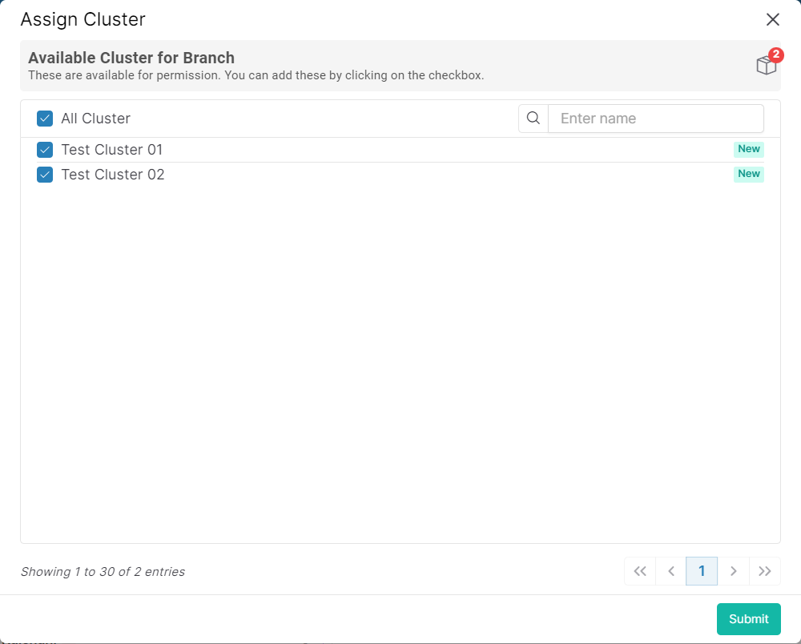

### Please follow these steps to assign asset<sup>[1]</sup> in branch
1. Select a branch where you want to add an asset<sup>[1]</sup>. If your selected branch level is ```Global``` level branch, then you don't need to assign the asset<sup>[1]</sup> to it. For ```Global``` level child branch, all assets<sup>[1]</sup> of parent branch are assigned in child branch by default. If you select cluster or zone or site level branch, then you will see ```Assign Cluster``` or ```Assign Zone``` button. For demonstration, Here we will discuss using ```Cluster Level Branch```. To assign cluster click on ```Assign Cluster``` button. On button click following pop-up window will display according to Branch level.


2. All available cluster for branch is listed. Click on the checkbox for add to the list.

3. After that click on ```submit``` button.

---
1. Asset = Site or Zone or Cluster
