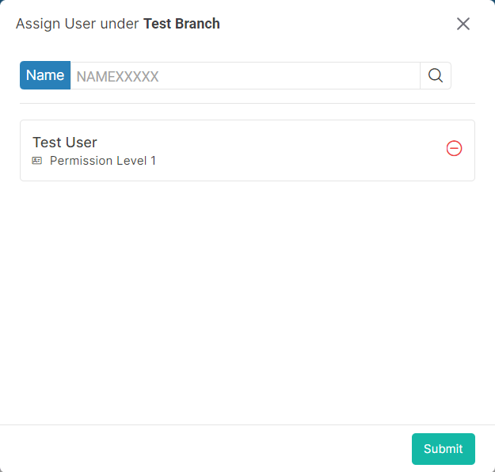

### Please follow these steps to assign custodian in selected branch
1. Select a branch where you want to add custodian.
2. Then click on the ```Assign``` button. On button click following pop-up window will display.


3. From ```search bar``` search specific user. you can search user by their name. Select search option and enter search keyword. On enter search keyword, you will get keyword related users. Then select your desire users.

4. After that click on ```submit``` button.
