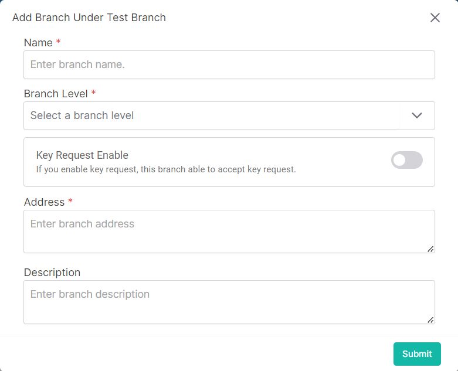

### Please follow these steps to create a new child branch
1. Click on the dropdown menu button.

2. Then click on ```Add Child Branch``` button.
3. A following pop-up window will come.

</br>

4. Insert data in all required (<span>*</span>) field.

- If this feature is enabled the branch will be able to accept key request.


5. Insert data in all required (<span>*</span>) field.
6. After filling up all data click on ```submit``` button.
