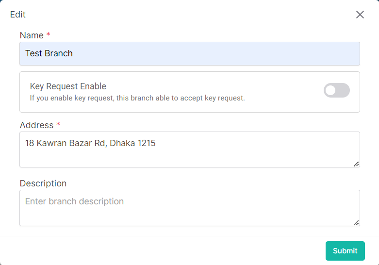

### Please follow these steps to edit a child branch
1. Click on the dropdown menu button.

2. Then click on ```Edit``` button.
3. A following pop-up window will come.


4. Insert data in all required (<span>*</span>) field.

- If this feature is enabled the branch will be able to accept key request.


5. After filling up all data click on ```submit``` button.
