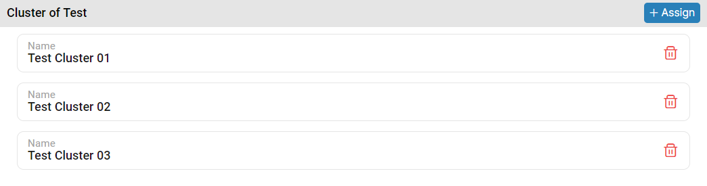
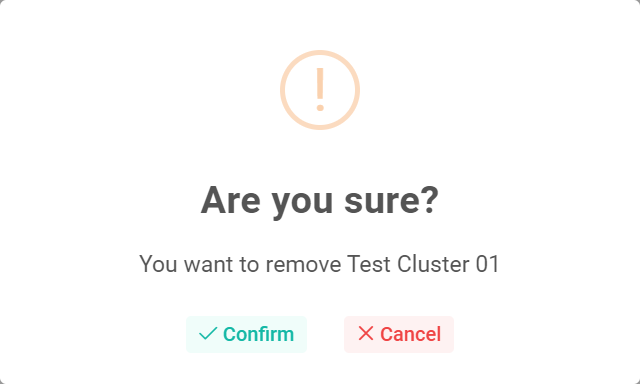

### Please follow these steps to remove asset from selected branch
1. Select a branch where you want to remove asset.
2. After select branch, assets that are assigned will be shown in the right panel.


3. Then click on the ```Delete``` button. </br> On button click following pop-up window will display.


4. After that click on ```Confirm``` button.
