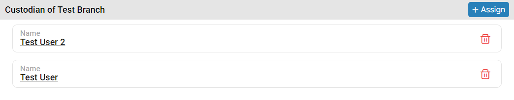

### Please follow these steps to remove custodian from selected branch
1. Select a branch where you want to remove custodian.
2. After select branch, custodians that are assigned will be shown in the right panel.


3. Then click on the ```Delete``` button. On button click following pop-up window will display.


4. After that click on ```Confirm``` button.
