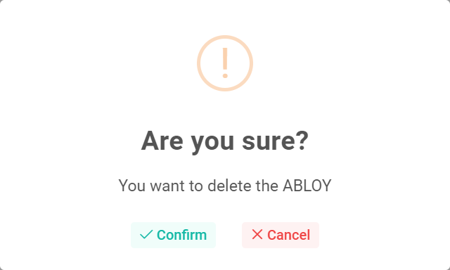

### Please follow these steps to delete a brand
1. Click on the dropdown menu button.


2. Then click on the ```Delete``` button. </br> On button click following pop-up window will display.


3. After that click on ```Confirm``` button.
