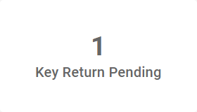
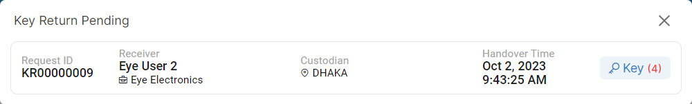
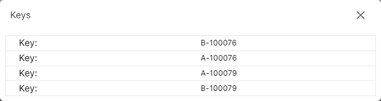

### Please follow these steps to view key return pending
1. Click on the following box.

</br>

2. A pop-up window displaying the key request list that pending key return will appear.

</br>

3. Select ```Key``` button to view keys.
