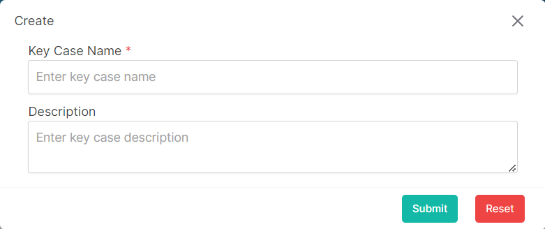

### Please follow these steps to create a new key case
1. Click on the ```Create``` button.
2. A following pop-up window will come.

</br>

3. Insert data in all required (<span>*</span>) field.
4. After filling up all data click on ```submit``` button.
