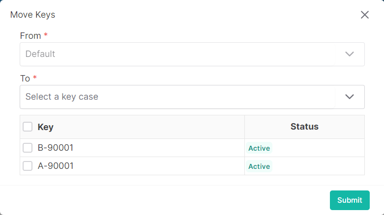

### Please follow these steps to move keys to another key case
1. Click on the dropdown menu button.

2. Then click on ```Move Keys``` button.
3. A following pop-up window will come.

</br>

4. Select destination key case and keys.
5. After selection, click on ```submit``` button.
