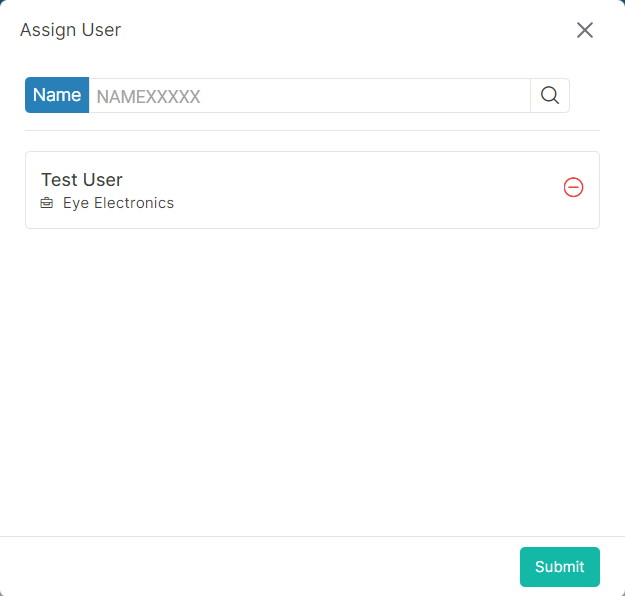

### Please follow these steps to assign key request user
1. To assign a new key request user click on the ```Assign User``` button.</br>
On button click following pop-up window will display.



2. From ```search bar``` search specific user. you can search user by their name. Select search option and enter search keyword. On enter search keyword, you will get keyword related users. Then select your desire users.

3. After that click on ```submit``` button.
