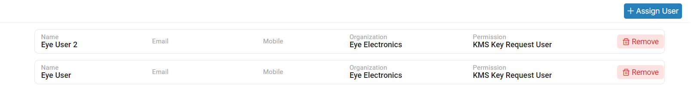
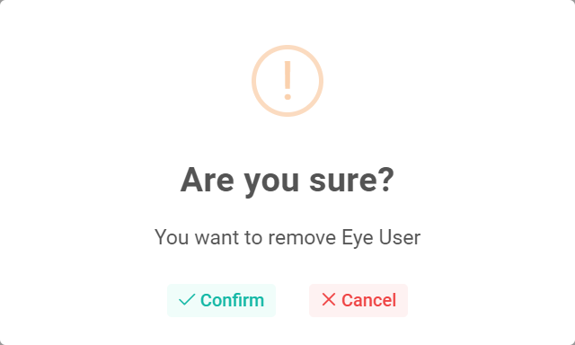

### Please follow these steps to remove key request user

1. To remove a key request user click on the ```Remove``` button.



2. On button click following pop-up window will display.


3. After that click on ```Confirm``` button.
