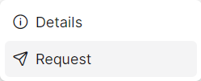

### Please follow these steps to create a key request
1. Click on the ```+ Create``` button.
2. A following pop-up window will come.

</br>

3. Insert data in all required (<span>*</span>) field.
4. After filling up all data click on ```submit``` button.

5. A following window displaying the key request draft list will appear.


6. Then Click on the dropdown menu button of specific draft request.


7. Then click on ```Request``` button.


8. A following pop-up window will appear.

</br>
9. Insert data in all required (<span>*</span>) field.
10. After filling up all data click on ```submit``` button.
