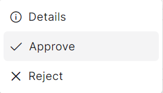
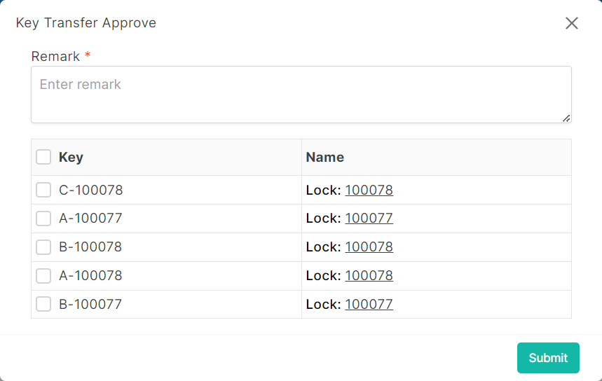

### Please follow these steps to approve key transfer
1. Click on the dropdown menu button.

2. Then click on ```Details``` button.


3. A following pop-up window will appear.

</br>
4. Select keys.
5. After select, click on ```submit``` button.
