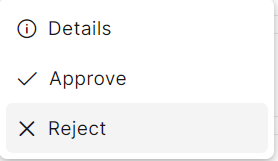
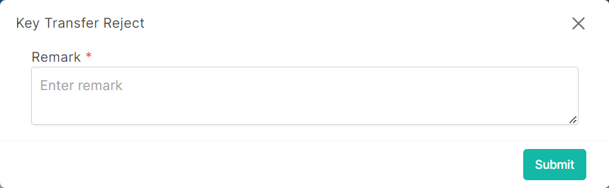

### Please follow these steps to reject key transfer
1. Click on the dropdown menu button.


2. Then click on ```Reject``` button.


3. A following pop-up window will come.

</br>

4. Insert data in all required (<span>*</span>) field.
5. After filling up all data click on ```submit``` button.
