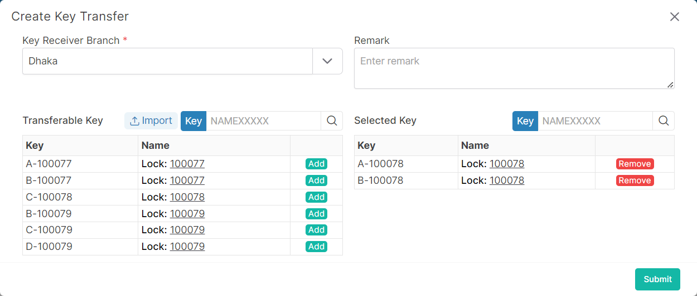

### Please follow these steps to create a key transfer
1. Click on the ```+ Create``` button.
2. A following pop-up window will come.

</br>

3. Select key receiver branch and keys.
4. After select, click on ```submit``` button.
