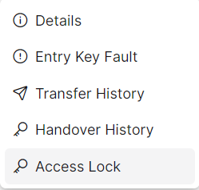
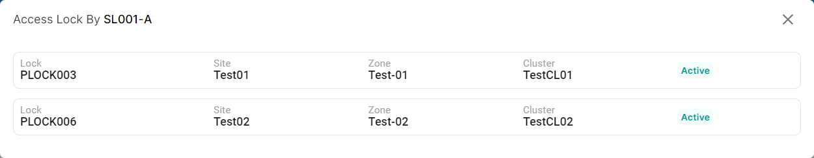

### Please follow these steps to view all accessible lock for the key
1. Click on the dropdown menu button.

2. Then click on ```Access Lock``` button.


3. The following pop-up window will appear with access lock information.

</br>