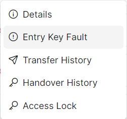
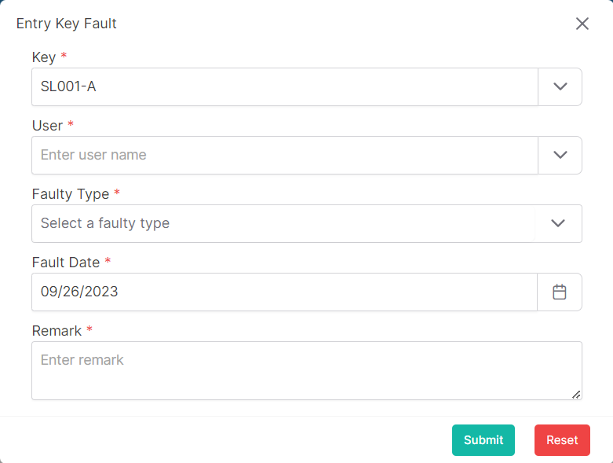

### Please follow these steps to create key fault
1. Click on ```Entry Key Fault``` button</br>
    ***or***</br>
    Click on the dropdown menu button of any keys.

2. Then click on ```Entry Key Fault``` button.


3. A following pop-up window will come.

</br>

4. Insert data in all required (<span>*</span>) field.
5. After filling up all data click on ```submit``` button.
