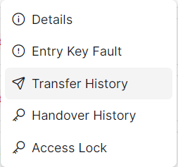
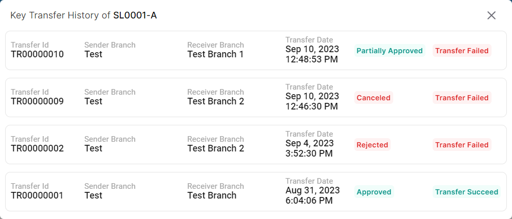

### Please follow these steps to view key transfer history
1. Click on the dropdown menu button.

2. Then click on ```Transfer History``` button.


3. A pop-up window displaying the key transfer history will appear.

</br>