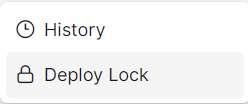
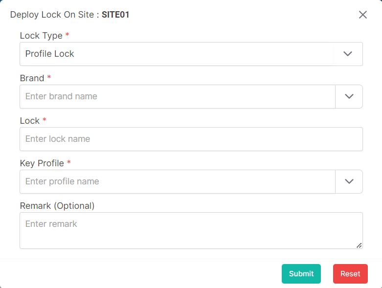

### Please follow these steps to view a site history
1. Click on the dropdown menu button.

2. Then click on ```Deploy Lock``` button.
3. A following pop-up window will come.


3. A following pop-up window will appear.

</br>

4. Insert data in all required (<span>*</span>) field.
5. After filling up all data click on ```submit``` button.
