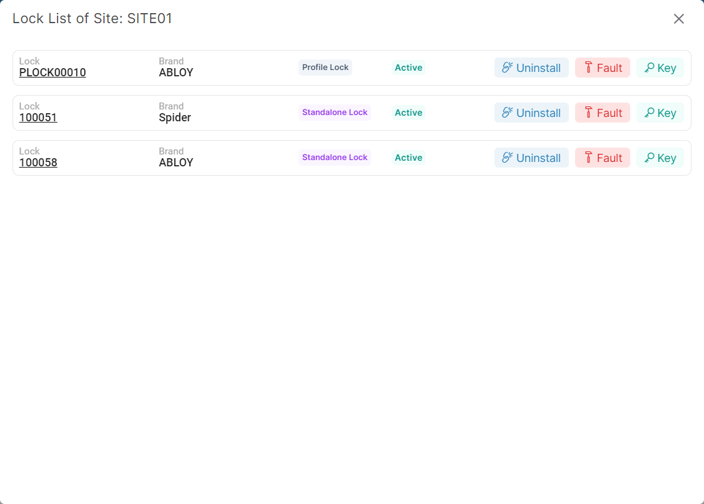
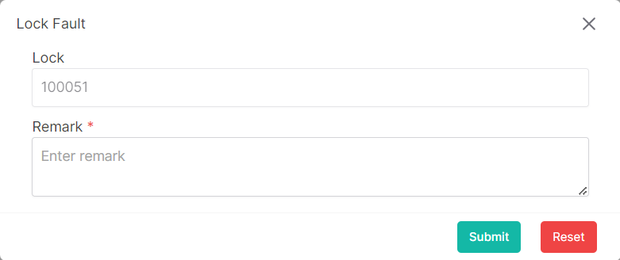

### Please follow these steps to create fault lock
1. Click on ```Lock``` button of a specific site.


2. A following pop-up window will appear.


3. Then lick on ```Fault``` button of a specific lock.

4. A following pop-up window will appear.


</br>

5. Insert data in all required (<span>*</span>) field.
6. After filling up all data click on ```submit``` button.
