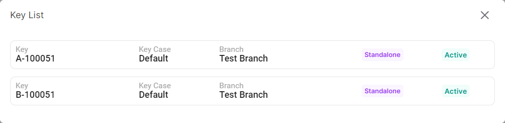

### Please follow these steps view all keys of a lock
1. Click on ```Lock``` button of a specific site.


2. A following pop-up window will appear.


3. Then lick on ```Key``` button of a specific lock.

4. A pop-up window displaying the key list will appear.

</br>