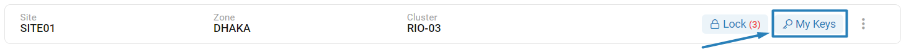
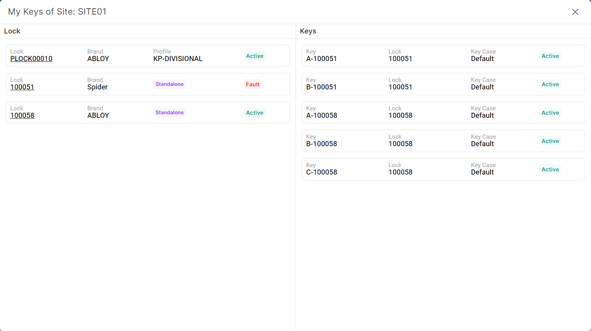

### Please follow these steps view custodian keys of a site
1. Click on ```My Keys``` button of a specific site.


2. A following pop-up window displaying the custodian key list will appear.

</br>